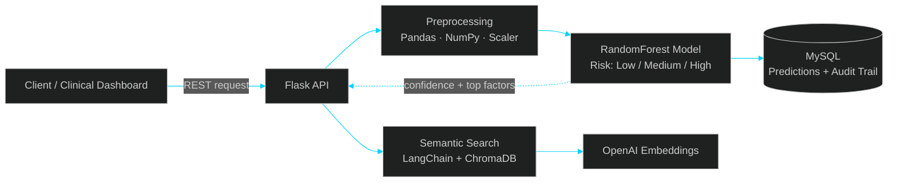
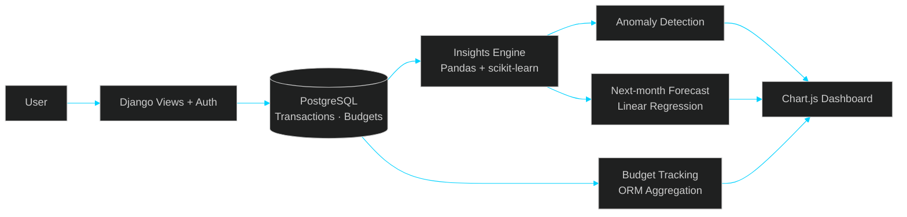

<!--
  TODO BEFORE PUBLISHING (search for "TODO"):
  1. Replace YOUR-LINKEDIN and YOUR-EMAIL@gmail.com (appears in header + footer)
  2. Fill the Education section at the bottom
  3. Optional: pin SmartSpend and Patient-Risk-Prediction-API on your profile
-->

<a id="top"></a>

<div align="center">


<a href="https://github.com/punniyam26-hash">
  
</a>

<br/><br/>


<br/>

<!-- TODO: replace YOUR-LINKEDIN and YOUR-EMAIL -->
<a href="https://www.linkedin.com/in/YOUR-LINKEDIN"></a>
<a href="mailto:YOUR-EMAIL@gmail.com"></a>
<a href="https://github.com/punniyam26-hash"></a>


<br/><br/>

<!-- NAV BAR -->
<a href="#summary"></a>
<a href="#impact"></a>
<a href="#problems"></a>
<a href="#architecture"></a>
<a href="#stack"></a>
<a href="#experience"></a>
<a href="#projects"></a>
<a href="#contact"></a>

</div>

<a id="summary"></a>
<h2 align="center">⚡ 30-Second Summary</h2>
<p align="center"><i>for Recruiters & Hiring Managers</i></p>

| | |
|---|---|
| **🎯 Role** | Python Backend / API Developer |
| **⏳ Experience** | 2+ years · 2 shipped products (healthcare, personal finance) |
| **🧰 Core Stack** | Django · DRF · Flask · FastAPI · PostgreSQL · MySQL · Docker · pytest |
| **🤖 AI / ML** | scikit-learn · Pandas · LangChain · ChromaDB · OpenAI embeddings |
| **🦸 Superpower** | Taking a feature from *requirements → data model → API → ML → deployment* on my own |
| **📊 Proof** | 87%+ model accuracy · 30,000+ records processed · 30% faster queries · 75%+ test coverage |
| **📍 Availability** | Open to work in Chennai (on-site / hybrid) & Remote |

---

<h2 align="center">👋 Hi, I'm Punniyamoorthy</h2>

I build **backend systems that are fast, reliable and smart.** Over the last 2 years I shipped REST APIs in **healthcare** (where every prediction must be explainable and auditable) and a **personal finance product** (where users want clarity, not just transaction lists), combining solid backend engineering with **Machine Learning** and **LLM-based search**.

> 🔭 **Building now:** SmartSpend, an AI-powered finance tracker
> 🌱 **Levelling up:** FastAPI, CI/CD, Redis, Celery
> 💬 **Ask me about:** FastAPI, Docker, pytest, query tuning, semantic search
> 🎯 **Looking for:** Python Backend / API Developer roles where I can own features end to end

---

<a id="impact"></a>
<h2 align="center">📈 Impact at a Glance</h2>

<div align="center">


<br/>


</div>

---

<a id="problems"></a>
<h2 align="center">🧩 Problems I've Solved</h2>

| Problem | What I did | Result |
|---|---|---|
| Raw patient data was too noisy for reliable predictions | Cleaned and preprocessed 30,000+ records with Pandas and NumPy | **+12% accuracy**, final model at 87%+ |
| Audit queries were slow as data grew | Designed composite indexes on MySQL | **30% faster** audit queries |
| Healthcare needs predictions that can be justified | Stored every prediction with confidence score and top risk factors | A complete **audit trail** for compliance |
| Clinical notes were hard to search by keyword | Built a semantic search layer (LangChain, ChromaDB, Sentence Transformers, OpenAI embeddings) | Search by **meaning**, not exact words |
| People don't know where their money goes | Built anomaly detection and a next-month forecast (Linear Regression) with Chart.js dashboards | Spending **insights**, not just transaction lists |

---

<a id="architecture"></a>
<h2 align="center">🏗️ Architecture Deep Dives</h2>

### 🏥 Patient Risk Prediction API



### 💸 SmartSpend



<details>
<summary>🔍 <b>Sample response: how the risk API explains itself</b> <i>(illustrative)</i></summary>

```json
{
  "patient_id": "P-10234",
  "risk_level": "High",
  "confidence": 0.89,
  "top_factors": ["blood_pressure", "age", "glucose_level"],
  "audit_id": "a1b2c3d4"
}
```

</details>

---

<a id="stack"></a>
<h2 align="center">🧰 Tech Stack</h2>

<div align="center">

**⚙️ Backend & Databases**<br/>


**🧪 Testing & DevOps**<br/>


**🎨 Frontend (working knowledge)**<br/>


**🤖 AI / ML / LLM**<br/>


**🔐 APIs & Tools**<br/>


</div>

---

<a id="experience"></a>
<h2 align="center">💼 Experience</h2>

### 🔹 Python Backend Developer · Flay High Software
**Dec 2025 – Present**

**SmartSpend:** AI-Powered Finance Tracker · `Django` `PostgreSQL` `Pandas` `scikit-learn` `Chart.js` `pytest` `Docker`

- Owned the product **end to end**: requirements, data modeling, backend, ML integration and UI
- Built an insights engine that **flags anomalous transactions** and **forecasts next-month spending** using Linear Regression
- Implemented budget tracking with Django ORM aggregation against user-defined monthly limits
- Created interactive **Chart.js dashboards** for category-wise spending breakdowns
- Designed authentication and a PostgreSQL-ready schema for transactions and budgets
- Wrote pytest suites for transaction, budget and forecasting logic; containerized the app with Docker

### 🔹 Python Backend Developer · NSEIT
**Oct 2024 – Nov 2025**

**Healthcare Patient Risk Prediction API** · `Flask` `scikit-learn` `Pandas` `MySQL` `ChromaDB` `LangChain` `OpenAI`

- Built and deployed a Flask REST API serving a **RandomForest model** that classifies patient risk (Low / Medium / High) with **87%+ accuracy**
- Preprocessed 30,000+ patient records, improving model accuracy by **12%**
- Delivered 4 REST endpoints for real-time prediction, patient history and dashboard statistics
- Added composite indexes on MySQL, cutting audit query time by **30%**
- Stored every prediction with confidence score and top risk factors, creating an **audit trail** for compliance
- Built a **semantic search layer** over clinical notes using ChromaDB, LangChain, Sentence Transformers and OpenAI embeddings
- Reached **75%+ code coverage** with unit tests, deployed to Linux production with **zero downtime incidents**

---

<a id="projects"></a>
<h2 align="center">🚀 Featured Projects</h2>

<table>
<tr>
<td width="50%" valign="top">

### 💸 SmartSpend
*AI-powered personal finance tracker*

- 🔍 Anomaly detection on transactions
- 📈 Next-month spending forecast
- 📊 Category-wise Chart.js dashboards
- 🐳 Dockerized and tested with pytest

`Django` `PostgreSQL` `scikit-learn` `Docker`

**[🔗 View Repository](https://github.com/punniyam26-hash/SmartSpend)**

</td>
<td width="50%" valign="top">

### 🏥 Patient Risk Prediction API
*ML-powered healthcare risk classifier*

- 🎯 87%+ accuracy RandomForest model
- 🧾 Audit trail with confidence scores
- 🧠 Semantic search over clinical notes
- ⚡ 30% faster queries via indexing

`Flask` `MySQL` `ChromaDB` `LangChain`

**[🔗 View Repository](https://github.com/punniyam26-hash/Patient-Risk-Prediction-API)**

</td>
</tr>
</table>

---

<h2 align="center">🎁 What I Bring to Your Team</h2>

| | |
|---|---|
| 🧭 **End-to-end ownership** | Requirements → data model → API → ML → deployment, with minimal handoffs |
| 🏭 **Production mindset** | Indexing, audit trails, testing, zero-downtime deployments |
| 🤝 **Backend + ML + LLM** | I can ship ML features without waiting for a separate AI team |
| 🏥 **Regulated-domain experience** | Healthcare and finance taught me explainability, traceability and data care |
| 💼 **Business understanding** | MBA background: I ask *why* a feature matters before I build it |

---

<h2 align="center">🧭 How I Work</h2>

1. **Make it work, make it right, make it fast**, in that order
2. **Measure before optimizing:** indexes, queries and models get numbers, not guesses
3. **Explainable by default:** every prediction I serve can say *why*
4. **Tests are part of the feature,** not a follow-up task
5. **Clear communication:** I write docs and PR descriptions that others can actually follow

<h2 align="center">🌱 Currently Levelling Up</h2>

- [ ] FastAPI (async endpoints, Pydantic validation)
- [ ] CI/CD pipelines (GitHub Actions)
- [ ] Redis caching and background jobs (Celery)
- [ ] ML in production · LLM-based semantic search

---

<h2 align="center">📊 GitHub Dashboard</h2>

<div align="center">


<br/>


<br/>


<br/>


</div>

---

<!-- TODO: fill this section, then remove this comment -->
<h2 align="center">🎓 Education</h2>

- 🎓 **MBA**: add college & year
- 🎓 **Degree**: add degree, college & year
- 📜 **Certifications**: add real certificates only (name, issuer, year)

---

<a id="contact"></a>
<h2 align="center">🤝 Let's Connect</h2>

<div align="center">

**Hiring for a Python Backend / API role? Let's talk. I reply fast.**<br/>
Open to opportunities in **Chennai & Remote**.

<br/>

<!-- TODO: replace YOUR-LINKEDIN and YOUR-EMAIL -->
<a href="https://www.linkedin.com/in/YOUR-LINKEDIN"></a>
<a href="mailto:YOUR-EMAIL@gmail.com"></a>
<a href="https://github.com/punniyam26-hash"></a>

<br/><br/>

*"Make it work, make it right, make it fast."* ⚡

<a href="#top">⬆ Back to top</a>

<!-- ============================== FOOTER ============================== -->


</div>
