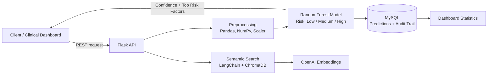

<!-- ===================== BANNER ===================== -->
<p align="center">
  
</p>

<p align="center">
  
</p>

<p align="center">
  
  
  
  
</p>

<p align="center">
  <a href="https://www.linkedin.com/in/punniyamoorthy-k"></a>
  <a href="mailto:punniyam26@gmail.com"></a>
  <a href="tel:+917397698715"></a>
</p>

---

## 👨‍💻 About Me

Hi, I'm **Punniyamoorthy** 👋, a **Python Backend Developer** with **2 years of experience** building REST APIs and data-driven backend systems in **healthcare** and **personal-finance** domains. I combine solid backend engineering with **ML and LLM-based features** so that products are not just working, but smart.

- 🔭 Currently building **SmartSpend**, an AI-powered finance tracker (Django, PostgreSQL, Scikit-learn)
- 🌱 Currently exploring **FastAPI, Docker, CI/CD**
- 💬 Ask me about **Django, Flask, REST API design, SQL optimization, ML in backend**
- 🎯 Looking for **Python Backend / API Developer** roles

---

## 📈 Impact at a Glance

| 🎯 Model Accuracy | 📂 Records Processed | ⚡ Query Speedup | 🧪 Test Coverage | 🔌 REST Endpoints |
|:---:|:---:|:---:|:---:|:---:|
| **87%+** | **30,000+** | **30% faster** | **70-75%+** | **4 delivered** |

---

## 🧰 Tech Stack

<table>
<tr>
<td valign="top" width="50%">

**Languages & Backend**


**Databases**


</td>
<td valign="top" width="50%">

**AI / ML**


**Testing & DevOps**


**Frontend (working knowledge)**


</td>
</tr>
</table>

### 📊 Skill Levels

```text
Python / Django / Flask   ▰▰▰▰▰▰▰▰▱▱  80%
REST API Design           ▰▰▰▰▰▰▰▰▱▱  80%
SQL / Query Optimization  ▰▰▰▰▰▰▰▱▱▱  70%
Scikit-learn / Pandas     ▰▰▰▰▰▰▰▱▱▱  70%
Testing (pytest/unittest) ▰▰▰▰▰▰▰▱▱▱  70%
LLM / Semantic Search     ▰▰▰▰▰▰▱▱▱▱  60%
FastAPI / Docker          ▰▰▰▰▰▱▱▱▱▱  50%
React (frontend)          ▰▰▰▰▱▱▱▱▱▱  40%
```

---

## 🏗️ How I Build: Patient Risk Prediction API



---

## 💼 Experience

<details open>
<summary><b>🔹 Python Backend Developer | Flay High Software</b> &nbsp;·&nbsp; <i>Dec 2025 – Present</i></summary>
<br>

**SmartSpend: AI-Powered Finance Tracker** | `Django` `PostgreSQL` `Pandas` `Scikit-learn` `Chart.js` `pytest` `Docker`

- Designed and built a full-stack finance tracker with authentication and a PostgreSQL-ready schema for transactions and budgets
- Built a spending-insights engine that flags **anomalous transactions** and **forecasts next-month spending** using Linear Regression
- Implemented budget tracking with Django ORM aggregation against user-defined monthly limits
- Created interactive **Chart.js dashboards** for category-wise spending breakdowns
- Wrote pytest suites for transaction, budget and forecasting logic; containerized the app with **Docker**
- Owned the project end to end: requirements, data modeling, backend, ML integration and UI

</details>

<details open>
<summary><b>🔹 Python Backend Developer | NSEIT</b> &nbsp;·&nbsp; <i>Oct 2024 – Nov 2025</i></summary>
<br>

**Healthcare Patient Risk Prediction API** | `Flask` `Scikit-learn` `Pandas` `NumPy` `MySQL` `ChromaDB` `LangChain` `OpenAI`

- Built and deployed a Flask REST API serving a **RandomForest model** that classifies patient risk (Low / Medium / High) with **87%+ accuracy**
- Preprocessed **30,000+ patient records**, improving model accuracy by **12%**
- Delivered **4 REST endpoints** for real-time prediction, patient history and dashboard statistics
- Added composite indexes on MySQL, reducing audit query time by **30%**
- Stored every prediction with confidence score and top risk factors, creating an **audit trail** for compliance
- Built a **semantic search layer** over clinical notes using ChromaDB, LangChain, Sentence Transformers and OpenAI embeddings
- Reached **75%+ code coverage** with unittest; deployed to Linux production with zero downtime incidents

</details>

---

## 🚀 Featured Projects

| Project | Description | Tech Stack |
|---------|-------------|------------|
| 💰 [SmartSpend](https://github.com/punniyam26-hash/YOUR-REPO-NAME) | AI-powered finance tracker with anomaly detection, spending forecast and budget dashboards | Django, PostgreSQL, Scikit-learn, Chart.js, Docker |
| 🏥 [Patient Risk Prediction API](https://github.com/punniyam26-hash/YOUR-REPO-NAME) | REST API that predicts patient risk level with confidence score and semantic search | Flask, RandomForest, MySQL, ChromaDB, LangChain |

---

## 🤝 What I Bring to Your Team

- ✅ **End-to-end ownership**: requirements → data model → API → ML → deployment
- ✅ **Production mindset**: indexing, audit trails, testing, zero-downtime deployments
- ✅ **Backend + ML + LLM** in one profile, so I can ship smart features without extra handoffs
- ✅ **Business understanding** (MBA) that helps me build what the product actually needs

---

## 📊 GitHub Stats

<p align="center">
  
  
</p>

<p align="center">
  
</p>

<p align="center">
  
</p>

### 🐍 Contribution Snake

<p align="center">
  <picture>
    <source media="(prefers-color-scheme: dark)" srcset="https://raw.githubusercontent.com/punniyam26-hash/punniyam26-hash/output/github-snake-dark.svg" />
    
  </picture>
</p>

---

## 🎓 Education

- 🎓 **MBA**, Business Management & Operations: Anna University, Chennai (2022 – 2024)
- 🎓 **B.Com**, Commerce, Accounting & Business Studies: Bharathidasan University (2019 – 2022)
- 📜 **Certification:** Python, React, FastAPI (Udemy, 2024)

---

<p align="center"><i>"Make it work, make it right, make it fast."</i> ⚡</p>

<p align="center">
  
</p>
