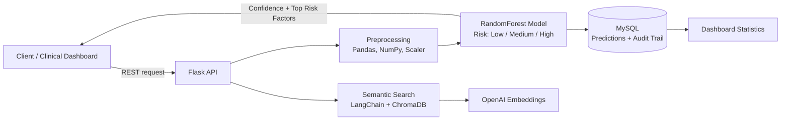

<!-- ===================== BANNER ===================== -->

  

  

  
  
  
  

  
  
  

<!-- ===================== PHOTO + INTRO ===================== -->
<table>
<tr>
<td width="30%" align="center">

 

**Punniyamoorthy K**
 
*Python Backend Developer*
 
📍 Chennai, India

</td>
<td width="70%">

### 👋 Hi, I'm Punniyamoorthy

I build **backend systems that are fast, reliable and smart**. Over the last **2 years** I have shipped REST APIs in the **healthcare** and **personal-finance** domains, combining solid backend engineering with **Machine Learning and LLM-based search**.

- 🔭 Currently building **SmartSpend**, an AI-powered finance tracker
- 🌱 Currently exploring **FastAPI, Docker, CI/CD**
- 💬 Ask me about **Django, Flask, REST design, SQL optimization, ML in backend**
- 🎯 Looking for **Python Backend / API Developer** roles

</td>
</tr>
</table>

---

## 📈 Impact at a Glance

<table align="center">
<tr>
<td align="center"><h2>87%+</h2>ML model accuracy</td>
<td align="center"><h2>30,000+</h2>patient records processed</td>
<td align="center"><h2>30%</h2>faster audit queries</td>
<td align="center"><h2>75%+</h2>test coverage</td>
<td align="center"><h2>4</h2>production REST endpoints</td>
</tr>
</table>

---

## 🧰 Tech Stack

  

<table>
<tr>
<td valign="top" width="50%">

**⚙️ Backend & Databases**

**🧪 Testing & DevOps**

</td>
<td valign="top" width="50%">

**🤖 AI / ML / LLM**

**🎨 Frontend (working knowledge)**

</td>
</tr>
</table>

---

## 🏗️ Architecture: Patient Risk Prediction API

---

## 💼 Experience

<b>🔹 Python Backend Developer | Flay High Software</b> &nbsp;·&nbsp; <i>Dec 2025 – Present</i>

 

**SmartSpend: AI-Powered Finance Tracker** | `Django` `PostgreSQL` `Pandas` `Scikit-learn` `Chart.js` `pytest` `Docker`

- Designed and built a full-stack finance tracker with authentication and a PostgreSQL-ready schema for transactions and budgets
- Built a spending-insights engine that flags **anomalous transactions** and **forecasts next-month spending** using Linear Regression
- Implemented budget tracking with Django ORM aggregation against user-defined monthly limits
- Created interactive **Chart.js dashboards** for category-wise spending breakdowns
- Wrote pytest suites for transaction, budget and forecasting logic; containerized the app with **Docker**
- Owned the project end to end: requirements, data modeling, backend, ML integration and UI

<b>🔹 Python Backend Developer | NSEIT</b> &nbsp;·&nbsp; <i>Oct 2024 – Nov 2025</i>

 

**Healthcare Patient Risk Prediction API** | `Flask` `Scikit-learn` `Pandas` `NumPy` `MySQL` `ChromaDB` `LangChain` `OpenAI`

- Built and deployed a Flask REST API serving a **RandomForest model** that classifies patient risk (Low / Medium / High) with **87%+ accuracy**
- Preprocessed **30,000+ patient records**, improving model accuracy by **12%**
- Delivered **4 REST endpoints** for real-time prediction, patient history and dashboard statistics
- Added composite indexes on MySQL, reducing audit query time by **30%**
- Stored every prediction with confidence score and top risk factors, creating an **audit trail** for compliance
- Built a **semantic search layer** over clinical notes using ChromaDB, LangChain, Sentence Transformers and OpenAI embeddings
- Reached **75%+ code coverage** with unittest; deployed to Linux production with zero downtime incidents

---

## 🚀 Featured Projects

<table>
<tr>
<td width="50%" valign="top">

### 💰 SmartSpend
*AI-powered personal finance tracker*

- 🔍 Anomaly detection on transactions
- 📉 Next-month spending forecast
- 📊 Category-wise Chart.js dashboards
- 🐳 Dockerized and tested with pytest

`Django` `PostgreSQL` `Scikit-learn` `Docker`

**[🔗 View Repository](https://github.com/punniyam26-hash/YOUR-REPO-NAME)**

</td>
<td width="50%" valign="top">

### 🏥 Patient Risk Prediction API
*ML-powered healthcare risk classifier*

- 🎯 87%+ accuracy RandomForest model
- 🧾 Audit trail with confidence scores
- 🔎 Semantic search over clinical notes
- ⚡ 30% faster queries via indexing

`Flask` `MySQL` `ChromaDB` `LangChain`

**[🔗 View Repository](https://github.com/punniyam26-hash/YOUR-REPO-NAME)**

</td>
</tr>
</table>

---

## 🤝 What I Bring to Your Team

| | |
|---|---|
| 🧩 **End-to-end ownership** | Requirements → data model → API → ML → deployment |
| 🏭 **Production mindset** | Indexing, audit trails, testing, zero-downtime deployments |
| 🤖 **Backend + ML + LLM** | Smart features shipped without extra handoffs |
| 💼 **Business understanding** | MBA background helps me build what the product actually needs |

---

## 📊 GitHub Stats

  
  

  

  

  <picture>
    <source media="(prefers-color-scheme: dark)" srcset="https://raw.githubusercontent.com/punniyam26-hash/punniyam26-hash/output/github-snake-dark.svg" />
    
  </picture>

---

## 🎓 Education

- 🎓 **MBA**, Business Management & Operations: Anna University, Chennai (2022 – 2024)
- 🎓 **B.Com**, Commerce, Accounting & Business Studies: Bharathidasan University (2019 – 2022)
- 📜 **Certification:** Python, React, FastAPI (Udemy, 2024)

---

## 📫 Let's Connect

  <b>Open to Python Backend / API Developer opportunities in Chennai & Remote.</b>  
  
  

<i>"Make it work, make it right, make it fast."</i> ⚡

  

