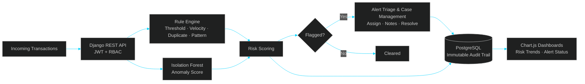
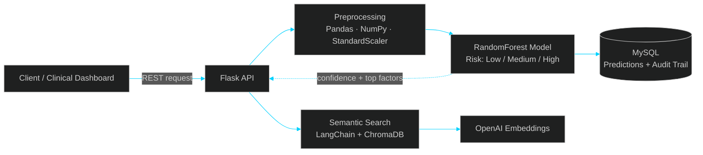

<!-- ============================== HEADER ============================== -->
<div align="center">


<a href="https://github.com/punniyam26-hash">
  
</a>

<br/><br/>


<br/>

<a href="https://www.linkedin.com/in/punniyamoorthy-k"></a>
<a href="mailto:punniyam26@gmail.com"></a>
<a href="https://github.com/punniyam26-hash"></a>


<br/><br/>

<!-- NAV BAR -->
<a href="#-impact-at-a-glance"></a>
<a href="#-problems-ive-solved"></a>
<a href="#-architecture-deep-dives"></a>
<a href="#-tech-stack"></a>
<a href="#-experience"></a>
<a href="#-featured-projects"></a>
<a href="#-lets-connect"></a>

</div>


<h2 align="center">⚡ 30-Second Summary</h2>
<p align="center"><i>for Recruiters & Hiring Managers</i></p>

| | |
|---|---|
| **🎯 Role** | Python Backend / API Developer |
| **⏳ Experience** | 2+ years · 2 production systems (healthcare risk prediction, fraud detection & audit monitoring) |
| **🧰 Core Stack** | Django · DRF · Flask · FastAPI · PostgreSQL · MySQL · Docker · pytest · unittest |
| **🤖 AI / ML** | scikit-learn (Isolation Forest, RandomForest, Logistic Regression) · Pandas · NumPy · LangChain · ChromaDB · OpenAI |
| **🔐 Security** | JWT · OAuth 2.0 · Role-Based Access Control (RBAC) · Audit trails |
| **🦸 Superpower** | Taking a feature from *requirements → data model → API → ML → deployment* on my own |
| **📊 Proof** | 87%+ model accuracy · 30,000+ records processed · 30% faster queries · 70-75%+ test coverage |
| **📍 Availability** | Open to work in Chennai (on-site / hybrid) & Remote |


<h2 align="center">👋 Hi, I'm Punniyamoorthy</h2>

I build **backend systems that are fast, reliable and explainable.** Over the last 2 years I have shipped REST APIs in **healthcare** (where every prediction must be auditable) and a **fraud detection & audit monitoring platform** (where every alert must be traceable), combining solid backend engineering with **Machine Learning** and **LLM-based semantic search**.

> 🔭 **Building now:** Fraud Detection & Audit Monitoring Platform (rule engine + anomaly detection)
> 🌱 **Levelling up:** FastAPI (async), CI/CD with GitHub Actions, Redis, Celery
> 💬 **Ask me about:** REST API design, anomaly detection, query tuning, audit trails, semantic search
> 🎯 **Looking for:** Python Backend / API Developer roles where I can own features end to end


<h2 align="center">📈 Impact at a Glance</h2>

<div align="center">


<br/>


</div>


<h2 align="center">🧩 Problems I've Solved</h2>

| Problem | What I did | Result |
|---|---|---|
| Raw patient data was too noisy for reliable predictions | Cleaned and preprocessed 30,000+ records (missing values, encoding, StandardScaler) | **+12% accuracy**, final model at 87%+ |
| Audit queries slowed down as data grew | Added composite indexes on `patient_id`, `risk_level`, `created_at` in MySQL | **30% faster** audit queries |
| Healthcare predictions must be justified | Stored every prediction with confidence score and top risk factors | A complete **audit trail** for compliance |
| Clinical notes were hard to search by keyword | Built a semantic search layer (LangChain, ChromaDB, Sentence Transformers, OpenAI embeddings) | Search by **meaning**, not exact words |
| Fraud investigators were flooded with false alerts | Combined a configurable rule engine with Isolation Forest scoring; tuned thresholds for precision vs recall | **Fewer false positives**, better-prioritized alerts |
| Flagged transactions needed accountability | Built an immutable audit trail of every flagged event, rule triggered, risk score and reviewer action | **Explainable** decisions ready for audit reporting |


<h2 align="center">🏗️ Architecture Deep Dives</h2>

### 🛡️ Fraud Detection & Audit Monitoring Platform



### 🏥 Patient Risk Prediction API



<details>
<summary>🔍 <b>Sample responses: how my APIs explain themselves</b> <i>(illustrative)</i></summary>

**Patient risk prediction**

```json
{
  "patient_id": "P-10234",
  "risk_level": "High",
  "confidence": 0.89,
  "top_factors": ["blood_pressure", "age", "glucose_level"],
  "audit_id": "a1b2c3d4"
}
```

**Fraud alert**

```json
{
  "alert_id": "AL-4821",
  "risk_score": 0.92,
  "status": "open",
  "rules_triggered": ["velocity_check", "duplicate_entry"],
  "anomaly_flag": true,
  "assigned_to": null
}
```

</details>


<h2 align="center">🧰 Tech Stack</h2>

<div align="center">

**⚙️ Backend & Databases**<br/>


**🧪 Testing & DevOps**<br/>


**🎨 Frontend (working knowledge)**<br/>


**🤖 AI / ML / LLM**<br/>


**🔐 APIs, Security & Testing**<br/>


</div>


<h2 align="center">💼 Experience</h2>

### 🔹 Python Backend Developer · Flay High Software
**Dec 2025 – Present**

**Fraud Detection & Audit Monitoring Platform** · `Django REST Framework` `PostgreSQL` `Pandas` `scikit-learn` `Docker` `pytest`

- Designed and built a backend that **screens transactions in real time** and flags suspicious activity for audit and compliance teams
- Implemented a **configurable rule engine** (threshold, velocity, duplicate-entry, unusual-pattern checks) combined with **Isolation Forest** anomaly detection to generate a risk score per transaction
- Engineered features with Pandas and NumPy and **tuned alert thresholds** to balance precision and recall, reducing false positives for investigators
- Built **alert triage and case management APIs** (assignment, status tracking, investigator notes, resolution) secured with **RBAC and JWT**
- Created an **immutable audit trail** logging every flagged event, rule triggered, risk score and reviewer action
- Developed monitoring dashboards for flagged transactions, risk trends and alert status using Chart.js
- Wrote pytest suites for rules, scoring and alert workflows; containerized with Docker

### 🔹 Python Backend Developer · NSEIT
**Oct 2024 – Nov 2025**

**Healthcare Patient Risk Prediction API** · `Flask` `scikit-learn` `Pandas` `NumPy` `MySQL` `ChromaDB` `LangChain` `OpenAI`

- Built and deployed a Flask REST API serving a **RandomForest model** that classifies patient risk (Low / Medium / High) with **87%+ accuracy**, exposed via 4 endpoints for real-time prediction, patient history and dashboard statistics
- Preprocessed **30,000+ patient records** (missing values, categorical encoding, StandardScaler), improving accuracy by **12%**
- Optimized the MySQL schema with composite indexes, cutting audit query time by **30%**
- Stored every prediction with confidence score and top risk factors, creating an **audit trail** for compliance and model monitoring
- Built a **semantic search layer** over clinical notes using ChromaDB, LangChain, Sentence Transformers and OpenAI embeddings
- Reached **75%+ code coverage** with unittest suites; deployed to Linux production with **zero downtime incidents**


<h2 align="center">🚀 Featured Projects</h2>

<table>
<tr>
<td width="50%" valign="top">

### 🛡️ Fraud Detection & Audit Monitoring
*Rule engine + ML anomaly detection*

- ⚙️ Configurable rules: threshold, velocity, duplicates
- 🌲 Isolation Forest risk scoring
- 🗂️ Alert triage, case management, RBAC + JWT
- 🧾 Immutable audit trail
- 🐳 Dockerized and tested with pytest

`Django REST` `PostgreSQL` `scikit-learn` `Docker`

</td>
<td width="50%" valign="top">

### 🏥 Patient Risk Prediction API
*ML-powered healthcare risk classifier*

- 🎯 87%+ accuracy RandomForest model
- 🧾 Audit trail with confidence scores
- 🧠 Semantic search over clinical notes
- ⚡ 30% faster queries via indexing

`Flask` `MySQL` `ChromaDB` `LangChain`

**[🔗 View Repository](https://github.com/punniyam26-hash/Patient-Risk-Prediction-API)**

</td>
</tr>
<tr>
<td width="50%" valign="top">

### 💸 SmartSpend *(Personal Project)*
*AI-powered personal finance tracker*

- 🔍 Anomaly detection on transactions
- 📈 Next-month spending forecast (Linear Regression)
- 📊 Category-wise Chart.js dashboards
- 🐳 Dockerized and tested with pytest

`Django` `PostgreSQL` `scikit-learn` `Docker`

**[🔗 View Repository](https://github.com/punniyam26-hash/SmartSpend)**

</td>
<td width="50%" valign="top">

### 🔜 Up Next
*FastAPI microservice*

- ⚡ Async endpoints with Pydantic validation
- 🧰 Redis caching + Celery background jobs
- 🔄 GitHub Actions CI/CD pipeline

`FastAPI` `Redis` `Celery` `GitHub Actions`

</td>
</tr>
</table>


<h2 align="center">🎁 What I Bring to Your Team</h2>

| | |
|---|---|
| 🧭 **End-to-end ownership** | Requirements → data model → API → ML → deployment, with minimal handoffs |
| 🏭 **Production mindset** | Indexing, audit trails, RBAC, testing, zero-downtime deployments |
| 🤝 **Backend + ML + LLM** | I can ship ML features without waiting for a separate AI team |
| 🏥 **Regulated-domain experience** | Healthcare and fraud/audit work taught me explainability, traceability and data care |
| 💼 **Business understanding** | MBA background: I ask *why* a feature matters before I build it |


<h2 align="center">🧭 How I Work</h2>

1. **Make it work, make it right, make it fast**, in that order
2. **Measure before optimizing:** indexes, queries, thresholds and models get numbers, not guesses
3. **Explainable by default:** every prediction and every alert can say *why*
4. **Tests are part of the feature,** not a follow-up task
5. **Clear communication:** I write docs and PR descriptions that others can actually follow

<h2 align="center">🌱 Currently Levelling Up</h2>

- [ ] FastAPI (async endpoints, Pydantic validation)
- [ ] CI/CD pipelines (GitHub Actions)
- [ ] Redis caching and background jobs (Celery)
- [ ] ML in production · LLM-based semantic search


<h2 align="center">📊 GitHub Dashboard</h2>

<div align="center">


<br/>


<br/>


</div>


<h2 align="center">🎓 Education & Certifications</h2>

| | |
|---|---|
| 🎓 **MBA**, Business Management & Operations | Anna University, Chennai · 2022 – 2024 |
| 🎓 **B.Com**, Commerce, Accounting & Business Studies | Bharathidasan University · 2019 – 2022 |
| 📜 **Certifications** | Python, React, FastAPI (Udemy, 2024) |
| 🗣️ **Languages** | Tamil (Native) · English (Professional) |


<h2 align="center">🤝 Let's Connect</h2>

<div align="center">

**Hiring for a Python Backend / API role? Let's talk.**<br/>
Open to opportunities in **Chennai (on-site / hybrid) & Remote**.

<br/>

<a href="https://www.linkedin.com/in/punniyamoorthy-k"></a>
<a href="mailto:punniyam26@gmail.com"></a>
<a href="https://github.com/punniyam26-hash"></a>

<br/><br/>

*"Make it work, make it right, make it fast."* ⚡

<!-- ============================== FOOTER ============================== -->


</div>
