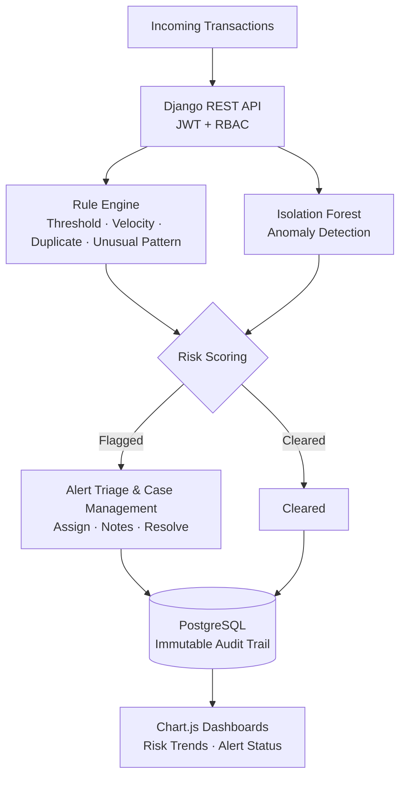
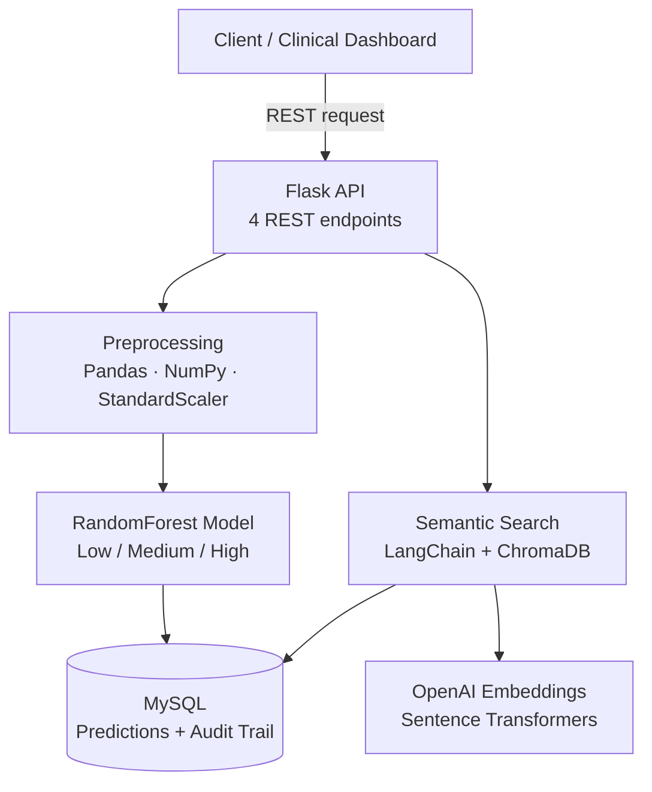

  

 

 

  

[Summary](#-professional-summary) &nbsp;|&nbsp;
[Impact](#-impact-at-a-glance) &nbsp;|&nbsp;
[Architecture](#-architecture-deep-dives) &nbsp;|&nbsp;
[Tech Stack](#-tech-stack) &nbsp;|&nbsp;
[Experience](#-experience) &nbsp;|&nbsp;
[Dashboard](#-github-dashboard) &nbsp;|&nbsp;
[Education](#-education--certifications) &nbsp;|&nbsp;
[Contact](#-lets-connect)

---

## 🎯 Professional Summary

Python Backend Developer with **2+ years** of experience building REST APIs and data-driven backend systems in **healthcare** and **fraud detection / audit monitoring** domains, using Django, Flask, FastAPI, PostgreSQL and MySQL.

- Built an **anomaly-detection and rule-based fraud monitoring platform** with audit trails and case review workflows
- Delivered a **patient risk-prediction API** with **87%+ model accuracy**
- Cut audit query times by **30%** through schema indexing
- Maintained **70-75%+ test coverage** with pytest and unittest
- Integrated **Scikit-learn models** and **LLM-based semantic search** (ChromaDB, LangChain, OpenAI) into production services

| | |
|---|---|
| **Role** | Python Backend / API Developer |
| **Experience** | 2+ years (healthcare, fraud detection & audit monitoring) |
| **Core Stack** | Django · DRF · Flask · FastAPI · PostgreSQL · MySQL · Docker · pytest |
| **AI / ML** | Scikit-learn (Isolation Forest, RandomForest) · Pandas · NumPy · ChromaDB · LangChain · OpenAI |
| **Security** | JWT · OAuth 2.0 · Role-Based Access Control (RBAC) |
| **Location** | Chennai, Tamil Nadu, India |
| **Languages** | Tamil (Native) · English (Professional) |

---

## 📈 Impact at a Glance

---

## 🧩 Problems I've Solved

| Problem | What I did | Result |
|---|---|---|
| Raw patient data was too noisy for reliable predictions | Cleaned and preprocessed 30,000+ records (missing values, categorical encoding, StandardScaler) | **+12%** model accuracy |
| Audit queries were slow on large data | Added composite indexes on `patient_id`, `risk_level`, `created_at` in MySQL | **30% faster** audit queries |
| Healthcare predictions had to be justified | Stored every prediction with confidence score and top risk factors | Complete audit trail for compliance |
| Clinical notes were hard to search by keyword | Built a semantic search layer (ChromaDB, LangChain, Sentence Transformers, OpenAI embeddings) | Natural-language retrieval |
| Fraud investigators were flooded with false alerts | Combined a rule engine with Isolation Forest and tuned thresholds for precision vs. recall | Fewer false positives for investigators |
| Flagged transactions needed accountability | Built an immutable audit trail of every flagged event, rule triggered, risk score and reviewer action | Explainability and audit reporting |

---

## 🏗️ Architecture Deep Dives

### 🛡️ Fraud Detection & Audit Monitoring Platform

### 🏥 Patient Risk Prediction API

---

## 🛠️ Tech Stack

**Languages**

**Backend**

**Databases**

**AI / ML**

Isolation Forest · RandomForest · Logistic Regression · Anomaly Detection · Feature Engineering · Semantic Search

**Fraud & Audit**

`Rule Engines` `Risk Scoring` `Alert Triage` `Audit Trail Logging` `Case Management` `Compliance Reporting`

**Testing**

**Tools & DevOps**

**Frontend (working knowledge)**

---

## 💼 Experience

### Python Backend Developer · Flay High Software
**Dec 2025 – Present**
*Fraud Detection & Audit Monitoring Platform*
`Python` `Django REST Framework` `PostgreSQL` `Pandas` `Scikit-learn` `Docker` `pytest`

- Designed and built a fraud detection and audit monitoring backend that screens transactions in real time and flags suspicious activity for audit and compliance teams.
- Implemented a configurable rule engine (threshold, velocity, duplicate-entry and unusual-pattern checks) combined with Scikit-learn **Isolation Forest** anomaly detection to generate risk scores for each transaction.
- Engineered features with Pandas and NumPy from historical transaction data and tuned alert thresholds to balance precision and recall, reducing false-positive alerts for investigators.
- Built alert triage and case management APIs covering alert assignment, status tracking, investigator notes and resolution, with **RBAC** and **JWT** authentication.
- Created an immutable audit trail that logs every flagged event, rule triggered, risk score and reviewer action, supporting explainability and audit reporting.
- Developed monitoring dashboards and summary reports for flagged transactions, risk trends and alert status using Chart.js.
- Wrote pytest suites for rules, scoring and alert workflows; containerized the application with Docker for consistent deployment.

### Python Backend Developer · NSEIT
**Oct 2024 – Nov 2025**
*Healthcare Patient Risk Prediction API*
`Flask` `Scikit-learn` `Pandas` `NumPy` `MySQL` `ChromaDB` `LangChain` `OpenAI API`

- Built and deployed a Flask REST API serving a Scikit-learn **RandomForest** model that classifies patient risk as Low, Medium or High with **87%+ accuracy** on test data, exposed through 4 REST endpoints for real-time prediction, patient history and dashboard statistics.
- Cleaned and preprocessed **30,000+ patient records** with Pandas and NumPy (missing-value handling, categorical encoding, StandardScaler), improving model accuracy by **12%**.
- Optimized the MySQL schema with composite indexes on `patient_id`, `risk_level` and `created_at`, reducing audit query response time by **30%**.
- Stored every prediction with its confidence score and top risk factors in MySQL, creating an audit trail for compliance reporting and model performance monitoring.
- Built a semantic search layer over clinical notes and patient records using ChromaDB, LangChain, Sentence Transformers and OpenAI embeddings for natural-language retrieval.
- Reached **75%+ code coverage** with unittest suites and deployed services to a Linux production environment with **zero downtime incidents**.

---

## 🚀 Featured Projects

<table>
<tr>
<td width="50%" valign="top">

### 🛡️ Fraud Detection & Audit Monitoring
*Rule engine + ML anomaly detection*

- Configurable rules: threshold, velocity, duplicates
- Isolation Forest risk scoring
- Alert triage, case management, RBAC + JWT
- Immutable audit trail
- Chart.js dashboards
- Dockerized and tested with pytest

`Django REST` `PostgreSQL` `Scikit-learn` `Docker`

<a href="https://github.com/punniyam26-hash?tab=repositories">View Repository →</a>

</td>
<td width="50%" valign="top">

### 🏥 Patient Risk Prediction API
*ML-powered healthcare risk classifier*

- 87%+ accuracy RandomForest model
- Predictions stored with confidence scores
- Semantic search over clinical notes
- Composite-indexed MySQL (30% faster queries)
- 75%+ test coverage with unittest

`Flask` `Scikit-learn` `MySQL` `ChromaDB` `LangChain`

<a href="https://github.com/punniyam26-hash?tab=repositories">View Repository →</a>

</td>
</tr>
</table>

---

## 🤝 What I Bring to Your Team

| | |
|---|---|
| **End-to-end ownership** | From requirements to data model, API, ML integration and deployment |
| **Production mindset** | Indexing, audit trails, RBAC, testing and zero-downtime deployments |
| **Regulated-domain experience** | Healthcare and fraud/audit work taught me explainability, traceability and data care |
| **Business understanding** | MBA background (Business Management & Operations) |

---

## 📊 GitHub Dashboard

 

 

 

---

## 🎓 Education & Certifications

| | |
|---|---|
| **MBA**, Business Management & Operations | Anna University, Chennai · 2022 – 2024 |
| **B.Com**, Commerce, Accounting & Business Studies | Bharathidasan University · 2019 – 2022 |
| **Certification** | Python, React, FastAPI (Udemy, 2024) |
| **Languages** | Tamil (Native) · English (Professional) |

---

## 🤝 Let's Connect

**Hiring for a Python Backend / API role? Let's talk.**
Open to opportunities in **Chennai** (on-site / hybrid) & **Remote**.

<!-- ===================== FOOTER ===================== -->

 

 

intha code la enakku tailwind css and more code add panni super ah oru full code return  kodu
